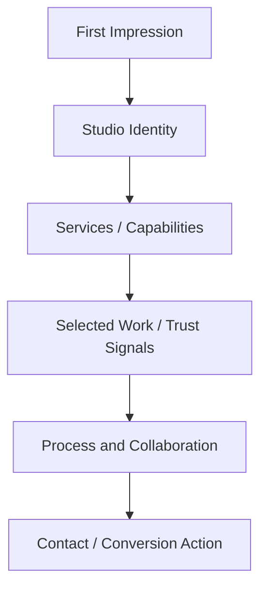

## Overview

Artspire Studio Web is a private TypeScript project built around a **creative studio web experience**. The goal is to present a studio, its work, and its identity through a polished web interface that feels intentional rather than template-driven.

Because the repository is private, this case study focuses on the public-facing product thinking and frontend engineering approach instead of exposing internal business logic or unreleased implementation details.

This project shows a different side of my work — not only systems, security tools, and developer utilities, but also **brand-aware frontend execution** where layout, spacing, responsiveness, and visual rhythm matter.

## The Problem

Creative studio websites have a deceptively hard job. They need to look distinctive, communicate trust quickly, and remain usable on every screen size. The challenge was to shape a frontend that could support:

- A strong first impression without becoming a slow marketing page
- Clear visual hierarchy for studio positioning, services, and work
- Reusable sections that can be edited or extended later
- Responsive behavior that preserves the brand feel on mobile
- A production structure that is maintainable beyond the first design pass

## Product Direction

The project treats the studio website as a **conversion and credibility surface**. Every section answers a visitor question: *What kind of studio is this? What work does it do? Why should a client trust it? What does the process feel like? How can someone start a conversation?*

Instead of building disconnected decorative sections, the page flow moves from identity to proof to action:

## Frontend Architecture

The implementation is **TypeScript-first and component-oriented**. The main design goal was to keep sections reusable without over-abstracting too early.

The likely component boundaries include:

- Hero and brand positioning sections
- Service or capability blocks
- Portfolio/work preview areas
- Call-to-action sections
- Shared layout wrappers for spacing and responsive constraints
- Reusable typography and visual primitives

This structure makes it easier to change content later without rewriting the page from scratch.

## Design Considerations

For a creative studio experience, the interface needs more personality than an admin dashboard, but it still cannot become chaotic. The design work centers on balance:

- **Visual polish** — refined spacing, strong typography, and clear section rhythm
- **Readable content** — copy and headings that can be scanned quickly
- **Responsive composition** — layouts that adapt instead of simply shrinking
- **Performance awareness** — avoiding unnecessary heavy effects where static visual hierarchy works better
- **Brand consistency** — repeated design patterns so the site feels like one system

## Key Features

- **Creative Studio Positioning** — a brand-forward structure for presenting studio identity, services, and selected work
- **Responsive Interface** — layouts designed to remain readable and polished across mobile, tablet, and desktop
- **Typed Component Structure** — TypeScript helps reduce accidental prop mistakes and keeps UI sections easier to evolve
- **Reusable Page Sections** — sections can be rearranged or extended as the studio offering changes
- **Conversion-Oriented Flow** — the content structure supports discovery, trust-building, and action

## Technical Stack

- **Language**: TypeScript
- **Frontend**: Component-based web interface architecture
- **Design Focus**: Responsive layout, brand presentation, visual hierarchy, and reusable UI patterns
- **Deployment Readiness**: Built with the expectation that the interface can be maintained and iterated after launch

## Challenges

The hardest part of this kind of project is **restraint**. A creative website can easily become overloaded with animation, gradients, visual effects, and oversized sections. The better challenge is to make the page feel polished while keeping the visitor oriented.

This required thinking about which visual elements actually support the brand, which sections should be dense and which should breathe, how to keep mobile layouts from feeling like afterthoughts, and how to preserve consistency while still giving the page personality.

## What I Learned

Artspire helped reinforce that frontend work is not only about implementing components — it's also about sequencing information, tuning visual emphasis, and making sure the interface serves a real communication goal. The project strengthened my ability to think like both an engineer and a product designer: build components cleanly, but also ask whether the page actually helps a visitor understand and trust the brand.

## What It Shows

Artspire Studio Web adds a polished client-style project to the portfolio. It shows that alongside systems, security, AI, and developer tooling projects, I can also build refined presentation-focused websites for brands and creative teams.
