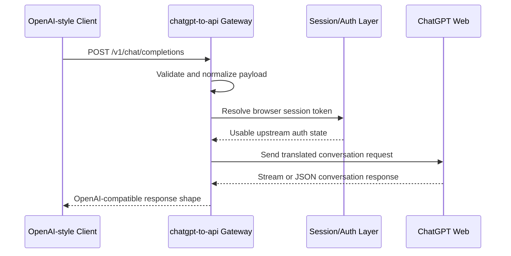

## Overview

chatgpt-to-api is an **API compatibility gateway** that lets tools expecting an OpenAI-style API shape communicate with ChatGPT Web-style conversations. The project exists at the boundary between developer tooling, protocol translation, and backend reliability.

The core idea is simple: a client should be able to send a familiar chat request, and the gateway should handle the uncomfortable parts behind the scenes — browser-session authentication, upstream request formatting, model routing, streaming response translation, and compatibility with clients that expect OpenAI-like endpoints.

This project demonstrates backend engineering that goes beyond CRUD. It involves reverse-engineering behavior, preserving compatibility, designing trust boundaries, and making multiple systems speak a common language.

## The Problem

Many developer tools, editors, dashboards, and scripts are built around OpenAI-compatible request formats. They expect endpoints such as chat completions, a `messages` array, model identifiers, and either JSON or streaming output.

ChatGPT Web does not naturally expose the same shape. It uses browser session state, different upstream payloads, conversation identifiers, and response formats that are not directly interchangeable with standard API clients.

The gateway solves this mismatch:

```text
OpenAI-style client
  -> familiar API request
  -> compatibility gateway
  -> ChatGPT Web session/auth handling
  -> upstream conversation request
  -> translated response back to the client
```

## Architecture

At a high level, the gateway works as a **translation layer**. The client stays boring and predictable, while the gateway absorbs the differences between APIs:



### Authentication Model

One of the most important parts is separating two different trust boundaries:

- The **upstream session** proves the gateway can talk to ChatGPT Web
- The **proxy API key** proves a client is allowed to use this gateway

Keeping those concerns separate makes the system easier to reason about. A user can protect the local or hosted proxy without exposing the upstream session directly to every client.

### Request Translation

OpenAI-style clients send a request made of roles and messages. ChatGPT Web expects a different conversation-oriented payload. The gateway turns one mental model into the other:

- Preserving user, assistant, and system message intent
- Building upstream-compatible conversation payloads
- Handling model identifiers and accepting compatibility fields
- Returning errors in a client-understandable way

Good compatibility work is successful when the caller **doesn't need to think about the translation layer at all**.

### Streaming

Streaming is more complex than a normal JSON response because the gateway has to translate events as they arrive. This required attention to response headers, incremental event parsing, client disconnect behavior, finalization events, and error handling during partial responses.

## Key Features

- **OpenAI-Compatible Surface** — accepts familiar chat request structures so existing clients require minimal changes
- **Message Translation** — converts stateless `messages` arrays into the upstream conversation format
- **Session Handling** — manages browser-session style authentication separately from client authorization
- **Streaming Support** — handles response streaming for incremental model output
- **Proxy API Key Boundary** — adds a local authorization layer to prevent accidental public exposure
- **Compatibility-First Design** — accepts common client fields even when upstream behavior differs

## Technical Stack

- **Runtime**: Node.js
- **API Layer**: Express-style HTTP server
- **Protocol Work**: Request normalization, response translation, streaming, and auth/session handling
- **Compatibility Layer**: OpenAI-style client request support for existing developer tooling

## Challenges

The main challenge was building something resilient around a system that was not originally designed to be used this way. Upstream request requirements can be strict, session state can expire, streaming formats can be awkward to parse, clients may send parameters that don't map cleanly upstream, and errors need to be translated into useful client feedback.

This made the project a strong exercise in practical backend robustness.

## What I Learned

This project improved my understanding of API compatibility layers. A good compatibility gateway is not only a proxy — it is a **contract translator**. I learned to think more carefully about trust boundaries, developer experience, streaming protocol behavior, error normalization, and how much compatibility to support without overpromising.

## What It Shows

chatgpt-to-api highlights API design, reverse-engineering discipline, backend reliability, streaming responses, and pragmatic developer tooling. It connects directly to real workflows because it helps existing tools use a familiar API surface.
