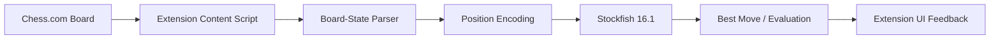

## Overview

Chess AI Extension is a browser-based project that integrates the **Stockfish 16.1** chess engine with Chess.com. It explores how a browser extension can read a live web interface, interpret a chess position, and connect that position to a high-strength chess engine for real-time analysis.

The project combines several different domains: browser extension development, DOM interaction, game-state parsing, engine integration, and real-time user feedback. It's also a good example of **applied AI that doesn't rely on a language model** — Stockfish is a specialized search and evaluation engine, and integrating it into a browser workflow requires a different kind of engineering discipline.

## The Problem

Chess.com presents a rich interactive board, but a browser extension has to understand that board from the outside. It cannot simply ask the application for a clean internal state. The extension needs to infer or extract:

- Which pieces are on which squares
- Whose turn it is and whether the board is flipped
- What the current legal context is
- How to convert the position into a format Stockfish understands

The core challenge is **bridging a visual web application and a chess engine** that expects structured position data.

## Architecture

The project works as a pipeline where each stage must be reliable — if the board extraction is wrong, the engine analysis becomes meaningless:

### Engineering Decisions

The most important decision was to **separate board detection from engine analysis**. Those concerns should not be tangled:

- Board parsing produces a clean position representation
- Engine integration consumes that representation
- UI rendering displays the result without knowing the details of engine execution

This separation makes the extension easier to debug — if analysis seems wrong, it's possible to inspect whether the board parser, notation converter, engine call, or display layer is responsible.

## Key Features

- **Stockfish 16.1 Integration** — uses a proven chess engine for position evaluation and move search
- **Browser Extension Workflow** — runs alongside an active Chess.com page
- **Game-State Parsing** — reads board context and translates it into engine-ready input
- **Interactive Analysis** — gives users engine-backed insight from the current board position
- **Niche AI Integration** — demonstrates how specialized engines can be embedded into user-facing tools

## Technical Stack

- **Language**: JavaScript
- **Platform**: Browser extension architecture
- **Engine**: Stockfish 16.1
- **Domain Logic**: Chess board parsing, position encoding, and move analysis
- **Integration Surface**: Content scripts and page-level interaction

## Challenges

Browser extensions are sensitive to changes in the target website. A small markup or class-name change can break DOM-dependent logic. Chess boards also introduce special cases — board orientation may change, piece positions need exact square mapping, move state changes quickly, the extension has to avoid slowing down the page, and engine output can be verbose and needs parsing.

These constraints make the project a strong exercise in careful integration work.

## What I Learned

This project helped me practice working with a specialized external engine inside a browser environment. It also reinforced the importance of **designing adapters** between messy real-world interfaces and clean domain logic. The most valuable learning was that good tooling often comes from translation: taking a complex system like Chess.com, a powerful engine like Stockfish, and building a small layer that lets them cooperate.

## What It Shows

Chess AI Extension adds a memorable niche project to the portfolio. It shows browser extension skills, game-domain logic, third-party page integration, and applied AI through a high-performance chess engine.
