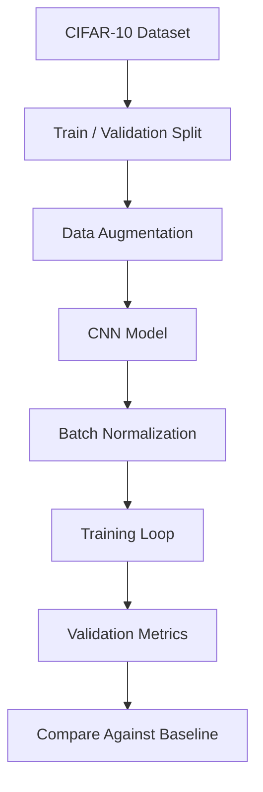

## Overview

CIFAR-10 Improved CNN is a computer-vision project focused on improving convolutional neural network performance **under constrained data conditions**. Instead of only training a baseline model, the project explores how architectural and training choices affect accuracy, convergence, and generalization.

The core techniques are **batch normalization** and **data augmentation**. Both are common in modern deep-learning workflows, but the project is valuable because it studies *why* they matter — especially when the model is trained on smaller subsets of data.

This project adds an ML engineering dimension to my portfolio, showing experimentation, model iteration, and the ability to reason about training behavior rather than treating machine learning as a black box.

## The Problem

CIFAR-10 is a standard image-classification dataset, but training on limited data makes the task harder. A CNN can quickly overfit — it learns patterns in the training subset but fails to generalize well to unseen images.

The project investigates how to improve performance when available training data is constrained:

- Avoiding overfitting on small data subsets
- Improving convergence stability during training
- Increasing robustness through image transformations
- Comparing a basic CNN against improved training strategies
- Making the experiment understandable through notebook-based analysis

## Approach

The project follows a practical ML workflow with a focus on understanding how each change affects the model:

### Batch Normalization

Batch normalization helps stabilize internal activations during training, leading to:

- Faster convergence and more stable gradients
- Better tolerance for learning-rate choices
- Reduced sensitivity to initialization

For a CNN trained on small image data, this makes the training process significantly more predictable.

### Data Augmentation

Data augmentation artificially increases variation in the training data by applying transformations such as flips, crops, or other image changes. This helps the model learn more robust visual patterns rather than memorizing exact examples. The practical benefit is **improved generalization** — a model that sees many transformed versions of the data is less likely to depend on fragile pixel-level shortcuts.

## Key Features

- **CNN Architecture Iteration** — experiments with convolutional model structure for image classification
- **Batch Normalization** — improves training stability and convergence behavior
- **Data Augmentation** — adds variation to limited training data to reduce overfitting
- **PyTorch Workflow** — uses notebook-based training, evaluation, and result inspection
- **CIFAR-10 Benchmarking** — uses a standard dataset for meaningful comparison
- **Small-Data Focus** — studies performance under constrained training conditions

## Technical Stack

- **Language**: Python
- **Environment**: Jupyter Notebook
- **ML Framework**: PyTorch
- **Dataset**: CIFAR-10
- **Techniques**: CNNs, batch normalization, data augmentation, training loops, evaluation metrics

## Evaluation

Evaluation in this project goes beyond a single accuracy score. A useful comparison looks at:

- Training accuracy versus validation accuracy
- Whether validation performance improves with augmentation
- Whether loss curves become smoother with normalization
- How quickly each model begins to converge
- Whether the improved model overfits less than the baseline

This style of evaluation makes the notebook more educational and shows the reasoning behind model changes.

## Challenges

Small-data training creates tradeoffs. A model that is too simple may underfit; a model that is too expressive may memorize the training subset. Augmentation can help, but too much augmentation can make learning harder if transformations are unrealistic. The challenge was to find practical improvements without turning the notebook into an uncontrolled experiment with too many variables.

## What I Learned

This project reinforced that model quality is often improved through **disciplined iteration** rather than one dramatic change. Batch normalization, augmentation, and architecture adjustments each solve different parts of the training problem. It also improved my ability to explain ML results in engineering terms — not just *what* changed, but *why* the change helped.

## What It Shows

CIFAR-10 Improved CNN adds machine-learning credibility to the portfolio. It demonstrates experimentation discipline, PyTorch workflow skills, and an understanding of model generalization on image-classification tasks.
