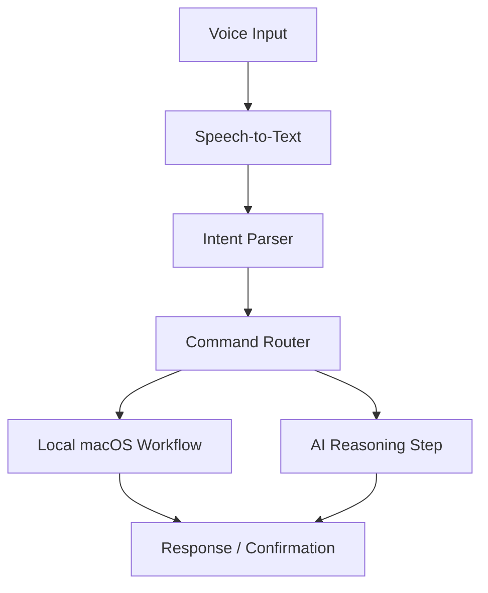

## Overview

Kirtos is a **local-first, voice-driven AI assistant concept for macOS**. The project explores what a desktop-native assistant could feel like if it were designed around spoken commands, local workflows, and fast access to personal productivity actions.

The idea is similar in spirit to a Jarvis-style assistant, but the engineering focus is practical: voice input, intent understanding, command routing, and desktop-oriented actions. Kirtos sits at the intersection of AI interfaces, local-first software, desktop tooling, and human-computer interaction — it's not just another chatbot UI, it's an experiment in making AI feel more **embedded in the operating environment**.

## The Problem

Most AI assistants live inside a browser tab or chat window. That is useful, but it creates friction when the user wants to perform local actions or move quickly between tasks. A desktop assistant should feel closer to the actual work environment.

The project asks:

- What if AI interaction started with voice instead of typing?
- What if the assistant could be designed around local workflows?
- How can natural-language intent become structured actions?
- How can the assistant stay useful without becoming intrusive?

## Architecture

At a high level, Kirtos is an **intent pipeline** where each layer has different failure modes:

Voice capture, AI interpretation, command execution, and UI feedback are kept as separate concerns. This modularity makes the system easier to debug and extend.

### Product Vision

The long-term vision is a macOS assistant that can listen for user commands, interpret the requested task, route it to the right workflow, and provide feedback quickly — all while keeping user control and local context central. The goal is not to build an assistant that tries to do everything at once, but to build a foundation that can grow into reliable, focused workflows.

### Design Decisions

The most important design decision is **local-first framing**. Even when AI services are involved, the assistant should feel like it belongs to the user's machine. That means prioritizing:

- Low-friction activation
- Clear confirmation before sensitive actions
- Predictable command routing
- Small, reliable workflows over vague general autonomy
- A UI that supports the task instead of becoming the main event

## Key Features

- **Voice-First Interaction** — designed around spoken commands rather than only typed prompts
- **Local-First Direction** — prioritizes user control and desktop-side execution where possible
- **AI Workflow Layer** — maps natural-language requests to structured assistant actions
- **macOS Productivity Focus** — targets everyday desktop workflows instead of generic chat
- **Expandable Command Model** — can grow by adding new intents and action handlers

## Technical Stack

- **Runtime**: JavaScript-based application logic
- **AI Interaction**: Prompt and command handling for assistant workflows
- **Platform Direction**: macOS-oriented desktop assistant experience
- **Interface Model**: Voice-driven input and assistant-style feedback

## Challenges

Voice assistants introduce challenges that text interfaces can avoid — speech recognition can mishear commands, natural language can be ambiguous, users need feedback when intent is uncertain, local actions may require permissions or confirmations, and the assistant must be useful without feeling disruptive. These constraints make the project a good exercise in designing AI systems that **respect user control**.

## What I Learned

Kirtos helped me think more deeply about AI product design. The hard part is not only connecting to a model — it's building a reliable interaction loop where the user says something, the system understands the intent, and the result is useful. It also reinforced the importance of limiting scope: a strong assistant should start with a few dependable workflows before expanding into broader automation.

## What It Shows

Kirtos adds an AI-product angle to the portfolio. It shows interest in agent interfaces, voice UX, local-first software, and practical assistant tooling beyond a basic chatbot.
