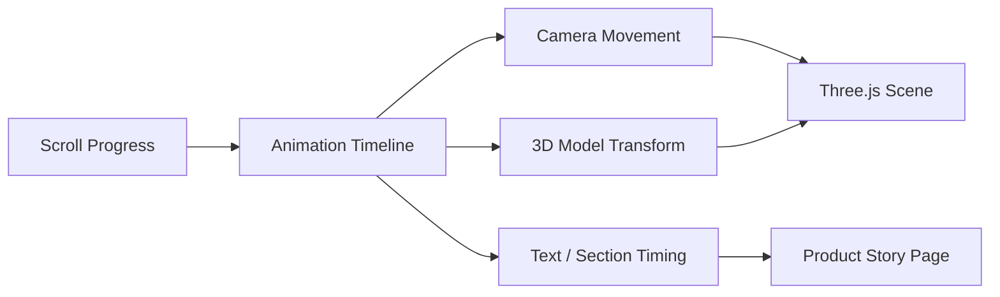

## Overview

MacBook Showcase Premium is an interactive 3D product presentation built with a premium frontend feel. The project focuses on scroll-driven motion, product framing, and immersive visual storytelling using Three.js and GSAP-style animation.

This project is intentionally different from a standard portfolio card or dashboard. It is a visual experiment that shows how frontend engineering can create a product-page experience that feels cinematic, responsive, and polished.

It adds an important dimension to my portfolio because it demonstrates high-impact UI work: animation timing, 3D composition, scroll behavior, and performance-aware visual design.

---

## Problem

Product showcase pages often rely on static screenshots or simple image sections. That can work, but it does not always communicate the feeling of a premium device or digital product.

The challenge was to build a page where the product presentation feels alive:

- The 3D model needs to feel integrated with the page.
- Scroll motion needs to feel intentional rather than random.
- Text and visuals need to support each other.
- Performance must remain acceptable despite 3D rendering and animation.
- The experience needs to work across screen sizes.

---

## Experience Design

The page is designed around motion as the primary storytelling tool. Instead of presenting everything at once, the user scrolls through stages of the product experience.

This kind of interface depends on pacing:

- Early sections establish the product.
- Scroll movement reveals or transforms the scene.
- Supporting content appears when it adds context.
- Motion is used to guide attention rather than decorate every element.

---

## Architecture

The project combines a 3D rendering layer with a page animation layer:

```text
Page layout
  -> scroll progress
  -> animation timeline
  -> Three.js scene updates
  -> product model transformation
  -> text and UI synchronization
```

The important engineering challenge is coordination. The 3D scene and the DOM content need to feel like one experience, even though they are rendered through different systems.



---

## Key Features

- **3D Product Scene**: Uses Three.js to create an interactive MacBook-style product showcase.
- **Scroll Choreography**: Ties page progress to animation timing and product movement.
- **Premium Visual Direction**: Focuses on clean hierarchy, smooth motion, and product-centered composition.
- **Responsive Presentation**: Adapts the visual experience across screen sizes.
- **Frontend Performance Practice**: Balances rich motion with practical rendering constraints.

---

## Technical Stack

- **3D Rendering**: Three.js.
- **Animation**: GSAP-style timelines and scroll-based motion.
- **Frontend**: TypeScript and modern web UI architecture.
- **Interaction Model**: Scroll-driven product storytelling.

---

## Engineering Decisions

The main decision was to treat the 3D scene as the hero of the page, not as a small decorative preview. That changes how the layout is built:

- The canvas needs stable dimensions.
- Text must not fight the product for attention.
- Motion should support the scroll path.
- The model should remain readable on both desktop and mobile.
- Animation should be smooth enough to feel premium.

These decisions make the interface feel more like a product launch page than a normal web section.

---

## Challenges

3D frontend work has several practical constraints:

- Canvas rendering can be expensive.
- Scroll-linked animation can feel jittery if not tuned.
- Mobile composition is harder because there is less space for both model and text.
- Lighting, camera position, and scale affect perceived quality.
- The experience has to degrade gracefully if performance is limited.

The project required thinking about both visual design and low-level rendering behavior.

---

## What I Learned

MacBook Showcase Premium improved my understanding of motion as a design system. Good animation is not only about movement. It is about sequence, timing, hierarchy, and restraint.

It also gave me more practice with the engineering side of rich interfaces: canvas sizing, scene composition, scroll state, and responsive visual framing.

---

## What It Shows

This project balances the heavier backend, AI, and security projects in my portfolio. It shows that I can also build polished, expressive, motion-rich frontend experiences with modern 3D web tools.
