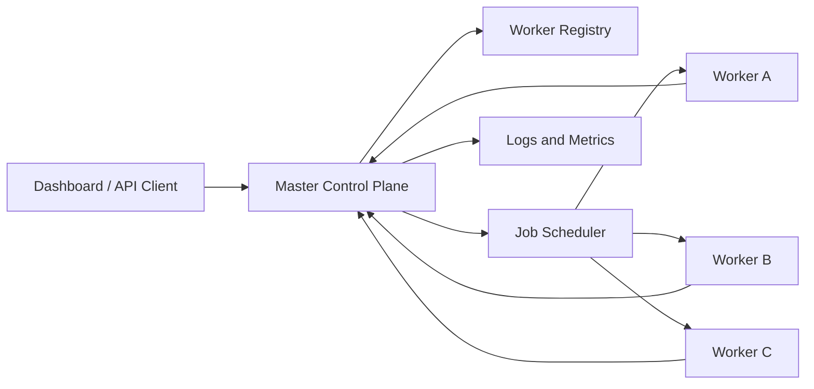

## Overview

Nebula Cluster is a **distributed worker orchestration platform** built around a master-client model. The goal is to coordinate many independent worker instances from a central control plane, turning small cloud services or local processes into a lightweight compute cluster.

The project is inspired by the useful parts of orchestration systems — registration, health checks, scheduling, logs, job state, retries, and observability. It's not meant to replace Kubernetes; instead, it explores a **simpler mental model** for coordinating background work across multiple machines or hosted services.

This is one of the strongest systems-oriented pieces in my portfolio because it demonstrates architecture beyond a single web server.

## The Problem

Running one background worker is simple. Running many workers across different environments is harder. Without a central control plane, it becomes difficult to answer basic operational questions:

- Which workers are online?
- Which worker is currently executing a job?
- Which jobs failed and need retrying?
- Which worker has the right capability for a task?
- How many jobs can a worker safely run at once?
- What happened during a job execution?

Nebula Cluster exists to make that distributed state **visible and manageable**.

## System Architecture

The project uses a master-client structure where global decisions live in the control plane while workers stay focused on execution:



### Worker Lifecycle

A typical worker lifecycle gives the system predictable, debuggable states:

```text
Worker starts
  -> loads configuration
  -> registers with control plane
  -> receives worker identity
  -> sends heartbeat updates
  -> accepts or polls for jobs
  -> executes assigned work
  -> streams or posts logs
  -> reports completion or failure
```

### Engineering Decisions

The most important decision was making **workers first-class entities**. A worker is not just a URL to call — it has identity, metadata, health, capacity, and execution history. That enables better decisions:

- Avoid assigning jobs to offline workers
- Prefer workers with matching capabilities
- Track provider-specific capacity
- Surface operational state in the dashboard
- Reason about failures after they happen

## Key Features

- **Central Control Plane** — tracks workers, jobs, logs, metrics, and execution state
- **Worker Registration** — workers report identity, provider, capacity, status, and capabilities
- **Heartbeat Monitoring** — the system detects when workers stop reporting health
- **Job Scheduling** — assigns work across available nodes while preserving execution visibility
- **Realtime Operations** — designed for live cluster status and job progress updates
- **Provider-Flexible Model** — supports hosted background services, VPS nodes, Docker containers, and local workers

## Technical Stack

- **Language**: TypeScript
- **Frontend / Dashboard**: Modern React-style interface patterns
- **Backend Model**: API-driven control plane for workers, jobs, and dashboard clients
- **Realtime Direction**: Event-driven updates for cluster status and job progress
- **Core Concepts**: Worker leases, heartbeats, scheduling, logs, and capacity management

## Challenges

Distributed systems fail in messy ways. Workers can disappear, jobs can hang, network calls can fail, and status can become stale. Even a small orchestration platform needs to think about heartbeat timeouts, duplicate assignment prevention, job retry behavior, worker capacity limits, partial failure handling, and log visibility for debugging.

Nebula Cluster is valuable because it forces those problems into the design early.

## What I Learned

This project strengthened my understanding of **control-plane architecture**. The hardest part is not only executing a job — it's knowing what the system *believes* is happening, keeping that state accurate, and giving operators enough visibility to trust it. It also helped me think about tradeoffs between simplicity and robustness: a lightweight scheduler can be useful without trying to become a full Kubernetes replacement.

## What It Shows

Nebula Cluster demonstrates system design thinking, distributed worker coordination, scheduling models, and operational tooling. It is one of the best projects in the portfolio for showing backend architecture and infrastructure-oriented thinking.
