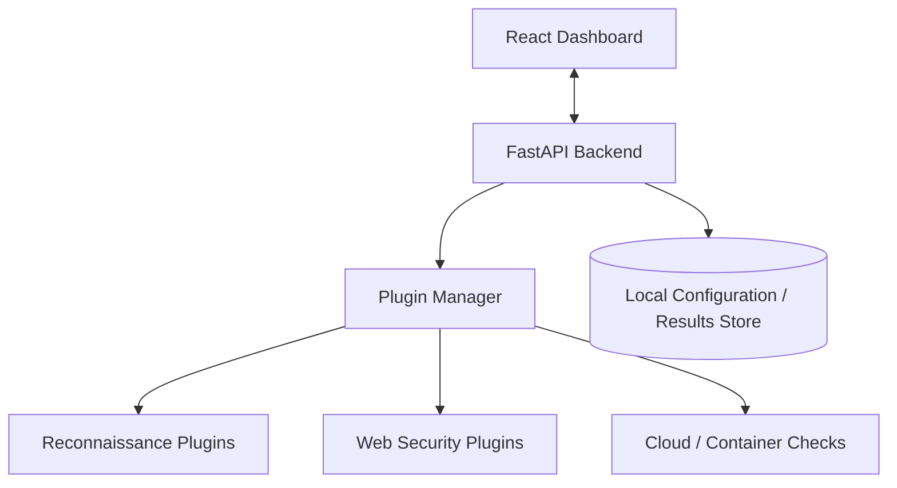

## Overview

SecuScan is a **local-first, plugin-driven security auditing and vulnerability-scanning platform**. It helps students, ethical hackers, and security learners run reconnaissance and scanning workflows from their own machine — keeping target data fully under their control.

The project combines a **FastAPI backend** with a **React dashboard**. The backend coordinates scan execution and plugin behavior, while the frontend provides a cleaner interface than raw terminal output. SecuScan is not just a script — it is a platform model for running, organizing, and reviewing security checks.

## The Problem

Security scanning often happens through scattered command-line tools. That approach is powerful, but it creates real pain points:

- Each tool has its own flags and output format
- Results are difficult to compare across tools
- Logs become messy during long-running scans
- Users lose track of scan configuration
- Running tools carelessly can create ethical or operational risk

SecuScan aims to make these workflows **more structured and visible** without hiding the learning process.

## Architecture

SecuScan separates user interaction from scan execution through a clean layered design:

The frontend focuses on visibility while the backend owns orchestration, validation, and plugin execution.

### Backend Responsibilities

The backend handles the security-sensitive parts of the workflow:

- Validating scan requests and managing plugin definitions
- Launching scanner processes or modules
- Tracking scan status and collecting logs
- Normalizing output and returning structured data to the dashboard

This separation prevents the frontend from directly controlling low-level scanning logic.

### Frontend Responsibilities

The dashboard makes scanning workflows easier to understand:

- Choose or configure scan types
- View active scan progress and inspect logs
- Review normalized findings
- Understand what happened after a scan completes

The goal is not to hide technical detail — it's to present it in a way that's easier to navigate.

## Local-First Philosophy

The local-first model is a deliberate design choice. Security targets, scan configuration, and diagnostic output can be sensitive — sending that data to a remote platform by default isn't always appropriate.

SecuScan is designed around these principles:

- **Data sovereignty** — scan data stays under the user's control
- **Controlled execution** — tools run in a local environment
- **Transparency** — users understand what is being executed
- **Ethical boundaries** — explicit target selection is enforced

This makes the project suitable for education, labs, and controlled assessments.

## Plugin-Driven Design

The plugin model is the core of the project. Instead of hard-coding one scanner, SecuScan organizes multiple scanning capabilities behind a common interface.

A plugin-oriented approach enables:

- Adding new scanners without rewriting the platform
- Normalizing output from different tools
- Grouping checks by category
- Running targeted workflows
- Extending the platform to cover future security domains

## Key Features

- **Local-First Architecture** — targets, scan config, and reports stay on your machine
- **Plugin-Driven Engine** — supports dynamic scanner definitions and future extensibility
- **Reconnaissance Workflows** — organizes network and service discovery tasks
- **Vulnerability Detection** — structured framework for running and reviewing security checks
- **Result Normalization** — converts varied scanner output into a consistent format
- **Live Scan Feedback** — logs, progress, and status visibility in real time
- **Safety-Oriented Workflow** — encourages explicit target selection and ethical usage

## Technical Stack

- **Backend**: FastAPI, Python
- **Frontend**: React dashboard
- **Runtime Model**: Local-first scan execution
- **Data Handling**: Local configuration and result storage
- **Security Tools**: Designed to integrate with recon and vulnerability scanners
- **Future Isolation**: Containerized plugin execution as a natural next step

## Challenges

Security tools are messy by nature. Different tools produce JSON, XML, plaintext, logs, exit codes, and partial results. A platform like SecuScan has to handle that variation gracefully.

The hardest challenges include designing a flexible plugin interface, normalizing inconsistent output, handling scanner failures, avoiding unsafe defaults, and keeping the tool useful for learners without oversimplifying the domain.

## Ethical Boundaries

Because SecuScan is a security scanning platform, ethical usage matters. The project is framed for controlled environments, authorized testing, labs, and learning.

- Scan only systems you own or have permission to test
- Make target selection explicit
- Avoid hiding risky actions behind one-click automation
- Present warnings or context where appropriate

Security tooling should teach **responsibility** along with capability.

## What I Learned

SecuScan strengthened my understanding of how security tools become platforms. The main work isn't only running a scanner — it's managing configuration, execution state, result parsing, user feedback, and safety. It also helped me think about developer experience for security learners: powerful enough to be real, but structured enough to be approachable.

## Future Roadmap

- More plugin categories and containerized scanner execution
- Report export and severity scoring
- Scan templates for common workflows
- Authentication for team usage
- Historical comparison of scan results
