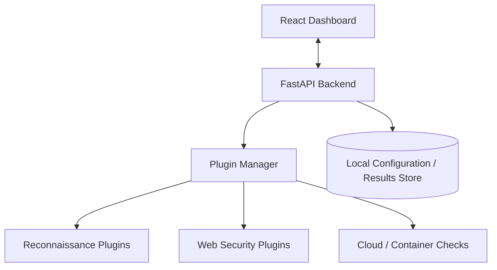

## Overview

SecuScan is a local-first, plugin-driven security auditing and vulnerability-scanning platform. It is designed to help students, ethical hackers, and security learners run reconnaissance and scanning workflows from their own machine while keeping target data under their control.

The project combines a FastAPI backend with a React dashboard. The backend coordinates scan execution and plugin behavior, while the frontend gives users a clearer interface than raw terminal output.

SecuScan is one of the strongest cybersecurity projects in my portfolio because it connects practical security tooling with product design. It is not just a script; it is a platform model for running, organizing, and reviewing security checks.

---

## Problem

Security scanning often happens through scattered command-line tools. That is powerful, but it can be difficult for learners or teams to manage:

- Each tool has its own flags and output format.
- Results are often difficult to compare.
- Logs can become messy during long scans.
- Users may lose track of scan configuration.
- Running tools carelessly can create ethical or operational risk.

SecuScan aims to make these workflows more structured and visible without hiding the learning process.

---

## Local-First Philosophy

The local-first model is important. Security targets, scan configuration, and diagnostic output can be sensitive. Sending that data to a remote platform by default is not always appropriate.

SecuScan is designed around the idea that:

- Scan data should stay under the user's control.
- Tools should run in a controlled local environment.
- Users should understand what is being executed.
- The system should support ethical boundaries and explicit target selection.

This makes the project suitable for education, labs, and controlled assessments.

---

## Architecture

SecuScan separates user interaction from scan execution:

This architecture keeps the frontend focused on visibility while the backend owns orchestration, validation, and plugin execution.

---

## Plugin-Driven Design

The plugin model is the core of the project. Instead of hard-coding one scanner, SecuScan can organize multiple scanning capabilities behind a common interface.

A plugin-oriented approach helps with:

- Adding new scanners without rewriting the platform.
- Normalizing output from different tools.
- Grouping checks by category.
- Running targeted workflows.
- Keeping the platform extensible for future security domains.

---

## Key Features

- **Local-First Architecture**: Targets, scan configuration, and reports stay on the user's machine.
- **Plugin-Driven Engine**: Supports dynamic scanner definitions and future extensibility.
- **Reconnaissance Workflows**: Helps organize network and service discovery tasks.
- **Vulnerability Detection**: Provides a structure for running security checks and reviewing findings.
- **Result Normalization**: Converts varied scanner output into a more consistent format.
- **Live Scan Feedback**: Designed for logs, progress, and status visibility.
- **Safety-Oriented Workflow**: Encourages explicit target selection and ethical usage.

---

## Technical Stack

- **Backend**: FastAPI and Python.
- **Frontend**: React dashboard.
- **Runtime Model**: Local-first scan execution.
- **Data Handling**: Local configuration and result storage.
- **Security Tools**: Designed to integrate with utilities such as reconnaissance and vulnerability scanners.
- **Future Isolation**: Containerized plugin execution is a natural extension for safer tool runs.

---

## Backend Responsibilities

The backend is responsible for the security-sensitive parts of the workflow:

- Validating scan requests.
- Managing plugin definitions.
- Launching scanner processes or modules.
- Tracking scan status.
- Collecting logs and results.
- Normalizing output.
- Returning structured data to the dashboard.

This separation prevents the frontend from directly controlling low-level scanning logic.

---

## Frontend Responsibilities

The dashboard is designed to make scanning workflows easier to understand:

- Choose or configure scan types.
- View active scan progress.
- Inspect logs.
- Review normalized findings.
- Understand what happened after a scan completes.

The goal is not to hide technical detail. The goal is to present it in a way that is easier to navigate.

---

## Challenges

Security tools are messy by nature. Different tools produce different formats: JSON, XML, plaintext, logs, exit codes, and partial results. A platform like SecuScan has to handle that variation gracefully.

The hardest challenges include:

- Designing a flexible plugin interface.
- Normalizing inconsistent output.
- Handling scanner failures.
- Avoiding unsafe defaults.
- Keeping the tool useful for learners without oversimplifying the domain.

---

## Ethical Boundaries

Because SecuScan is a security scanning platform, ethical usage matters. The project is framed for controlled environments, authorized testing, labs, and learning.

Important boundaries include:

- Scan only systems you own or have permission to test.
- Make target selection explicit.
- Avoid hiding risky actions behind one-click automation.
- Present warnings or context where appropriate.

This framing is important because security tooling should teach responsibility along with capability.

---

## What I Learned

SecuScan strengthened my understanding of how security tools become platforms. The main work is not only running a scanner. It is managing configuration, execution state, result parsing, user feedback, and safety.

It also helped me think about developer experience for security learners: powerful enough to be real, but structured enough to be approachable.

---

## Future Roadmap

Future improvements could include:

- More plugin categories.
- Containerized scanner execution.
- Report export.
- Severity scoring.
- Scan templates.
- Authentication for team usage.
- Historical comparison of scan results.

---

## What It Shows

SecuScan demonstrates cybersecurity engineering, backend orchestration, frontend dashboard design, plugin architecture, and ethical security tooling. It is a strong anchor project for my security-focused profile.

