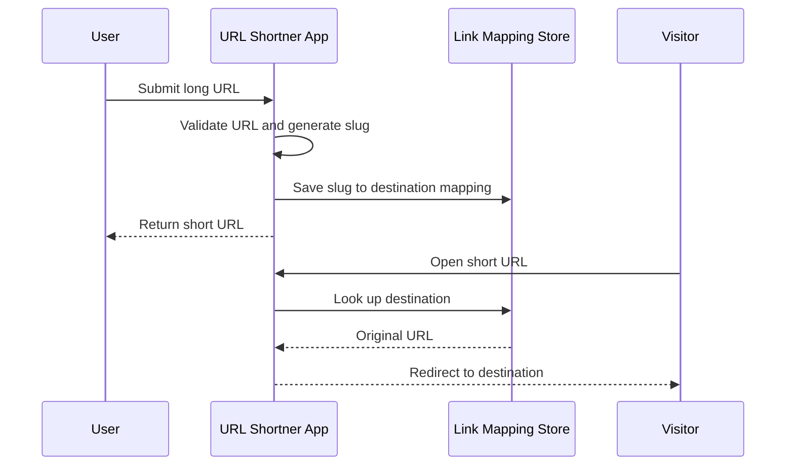

## Overview

URL Shortner is a focused web utility for creating **compact links from long URLs**. It is intentionally small in scope, but it demonstrates a complete product flow: user input, validation, short-code generation, storage, redirection, and public deployment.

Not every project needs to be a large distributed system. A strong utility app proves the ability to ship something simple, understandable, and usable end to end. The project also has a **live deployment**, which makes it easy for visitors to test the work instead of only reading about it.

## The Problem

Long URLs are hard to share, especially in messages, documents, and social contexts. A URL shortener solves this by mapping a long destination URL to a compact route. Even though the product sounds simple, it includes several important engineering concerns:

- Validating user-submitted URLs
- Generating unique short slugs
- Storing the mapping between slug and destination
- Redirecting visitors reliably
- Handling invalid or missing slugs
- Keeping the user flow fast and clear

## User Flow

The core flow is deliberately simple — the app should not make users think too much:

## Key Features

- **Short Link Creation** — accepts a long URL and generates a compact version for sharing
- **Redirect Flow** — resolves shortened paths back to the original destination
- **Live Deployment** — published on Vercel for direct testing
- **Simple Product UX** — keeps the core action fast and easy to understand
- **JavaScript Web Stack** — demonstrates core web app routing and frontend logic

## Technical Stack

- **Language**: JavaScript
- **Deployment**: Vercel
- **Core Concepts**: URL validation, slug generation, redirect routing, form handling, and deployment configuration

## Engineering Decisions

The biggest decision in a URL shortener is **how much complexity to introduce**. For a portfolio project, the goal is not to overbuild — it's better to create a clean, reliable version of the core workflow than to bury the app under unnecessary features.

The project focuses on a clear input experience, predictable short-link generation, a redirect route that behaves consistently, a deployed URL that visitors can test, and a code structure that can be expanded later.

### Edge Cases

Even small utilities need edge-case thinking. A URL shortener should consider empty input, invalid URL formats, duplicate or colliding short slugs, missing slug records, redirect safety, and user feedback when something fails. These details separate a quick demo from a more thoughtful web app.

## Possible Improvements

Future versions could add:

- Click analytics and custom slugs
- Expiration dates
- User accounts and link history
- QR code generation
- Abuse prevention and rate limiting

These would turn the app from a simple utility into a more complete link-management product.

## What I Learned

URL Shortner reinforced the value of **shipping small, complete projects**. It's easy to underestimate simple tools, but they still require clean routing, validation, deployment, and user feedback. The project also helped practice the discipline of keeping scope tight — a useful utility should do one thing well before adding advanced features.

## What It Shows

This project adds a clean deployed utility app to the portfolio. It shows that I can build and ship practical web products, not only large case-study systems.
