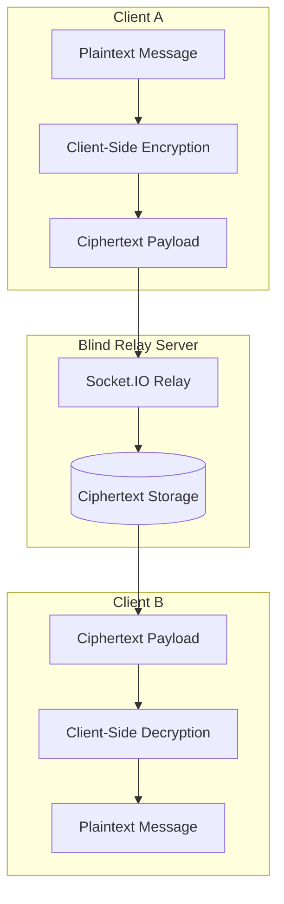

## Overview

Whispr is an **end-to-end encrypted messaging platform** built around a zero-trust backend relay model. The central idea is simple: the server should never need to read user messages in order to deliver them.

Encryption and decryption happen entirely on the client side. The backend is responsible for routing encrypted payloads, managing realtime delivery, and coordinating sessions — but it never possesses the plaintext message content.

This project combines security architecture, realtime systems, frontend engineering, backend design, and cryptographic thinking into a cohesive product.

## The Problem

Most chat systems rely on the backend as a trusted intermediary. The server receives messages, stores them, and often has the technical ability to inspect content. That model is simpler to build, but it creates a serious trust problem — if the server is compromised, misconfigured, or abused, plaintext messages may be exposed.

Whispr explores a stronger model:

- Clients encrypt messages **before** sending
- Servers only relay **ciphertext**
- Recipients decrypt messages **locally**
- The backend is treated as **untrusted infrastructure**

## Zero-Trust Architecture

The zero-trust design assumes that the backend network, logs, database, and relay layer may eventually fail or be inspected. The system is designed so that compromise of the relay does **not** reveal message content.



The server sees message metadata needed for delivery, but the actual message body remains encrypted.

## Message Flow

A simplified message flow through the system:

```text
Sender writes message
  -> client encrypts message locally
  -> encrypted payload is sent to relay
  -> server routes ciphertext to recipient
  -> recipient receives ciphertext
  -> recipient decrypts locally
  -> plaintext appears only on recipient client
```

The server is useful for delivery, but never trusted with content.

## Architecture Deep Dive

### Backend Responsibilities

The backend acts as a relay and coordination layer:

- Managing realtime socket connections
- Routing encrypted messages and handling delivery events
- Supporting user/session coordination
- Storing **only ciphertext** where persistence is needed

The backend does not need decryption keys or plaintext message access.

### Frontend Responsibilities

The client owns all the sensitive work:

- Generating or loading cryptographic keys
- Encrypting outgoing messages and decrypting incoming ones
- Managing chat UI state and handling realtime updates
- Presenting delivery and session feedback

This client-heavy model is what makes the zero-trust architecture possible.

### Key Management

Key management is one of the hardest parts of encrypted messaging. A secure system needs clients to establish shared secrets without exposing private keys to the server.

Whispr uses browser-native cryptographic APIs with the principle that private material should remain in the client context. The server only coordinates public or encrypted data needed for delivery.

This requires careful thinking about:

- Key generation and public key exchange
- Session establishment
- Message encryption and decryption
- Future multi-device behavior

## Key Features

- **End-to-End Encryption** — message content is encrypted before leaving the sender's device
- **Blind Relay Backend** — the server routes ciphertext without decrypting conversations
- **Realtime Messaging** — socket-based delivery keeps chat interactions responsive
- **Client-Side Cryptography** — uses browser-native Web Crypto API for key exchange and encryption
- **Zero-Trust Design** — the backend is intentionally not trusted with plaintext
- **Separated Client and Server** — frontend and backend can be reasoned about independently

## Technical Stack

- **Frontend**: Next.js, React, TypeScript
- **Backend**: Node.js, Express, Socket.IO
- **Cryptography**: Browser Web Crypto API
- **Realtime Layer**: WebSocket-style session delivery
- **Security Model**: Client-side key handling, ciphertext-only relay

## Challenges

Encrypted messaging is difficult because security and usability must work together. A system can be technically secure but unusable, or easy to use but weak in its trust model.

The main challenges include designing a clear key exchange flow, preventing plaintext from touching the backend, handling realtime delivery without weakening security, making encryption invisible enough for users while still being understandable, and planning for future features like multi-device sync or group chat.

## Security Considerations

Whispr's model reduces backend trust, but encrypted messaging still has important risks:

- Public key authenticity must be verified to prevent MITM attacks
- Clients must protect private key material
- Metadata can still reveal communication patterns
- Multi-device support introduces additional key-sync complexity

Acknowledging these risks is part of building security software responsibly.

## What I Learned

Whispr helped me understand that security architecture is mostly about **boundaries**. The central question isn't "Can the server deliver messages?" but "What should the server be *allowed* to know?"

The project also strengthened my knowledge of realtime systems and browser-native cryptography. It forced me to think about how cryptographic design affects frontend state, backend APIs, and user experience.

## Future Roadmap

- Out-of-band key verification and formal threat-model documentation
- Multi-device encrypted key sync
- Group chat encryption
- Message delivery receipts and encrypted attachments
- Safer local key storage
