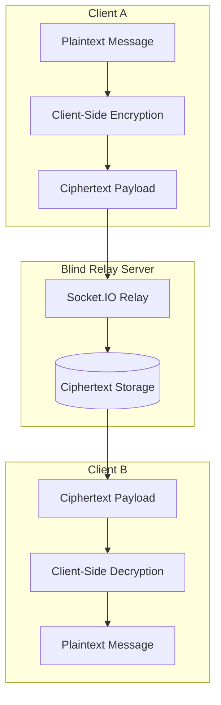

## Overview

Whispr is an end-to-end encrypted messaging platform built around a zero-trust backend relay model. The central idea is simple: the server should never need to read user messages in order to deliver them.

In Whispr, encryption and decryption happen on the client side. The backend is responsible for routing encrypted payloads, managing realtime delivery, and coordinating sessions, but it does not possess the plaintext message content.

This project is important in my portfolio because it combines security architecture, realtime systems, frontend engineering, backend design, and cryptographic thinking.

---

## Problem

Most chat systems rely on the backend as a trusted intermediary. The server receives messages, stores them, and often has the technical ability to inspect message content. That model is simpler to build, but it creates a serious trust problem.

If the server is compromised, misconfigured, or abused, plaintext messages may be exposed.

Whispr explores a stronger model:

- Clients encrypt messages before sending.
- Servers only relay ciphertext.
- Recipients decrypt messages locally.
- The backend is treated as untrusted infrastructure.

---

## Zero-Trust Architecture

The zero-trust design assumes that the backend network, logs, database, and relay layer may eventually fail or be inspected. The system is designed so that compromise of the relay does not automatically reveal message content.



The server sees message metadata needed for delivery, but the actual message body remains encrypted.

---

## Key Features

- **End-to-End Encryption**: Message content is encrypted before leaving the sender's device.
- **Blind Relay Backend**: The server routes ciphertext without decrypting conversations.
- **Realtime Messaging**: Socket-based delivery keeps chat interactions responsive.
- **Client-Side Cryptography**: Uses browser-native cryptographic capabilities for key exchange and message encryption.
- **Zero-Trust Design**: The backend is intentionally not trusted with plaintext.
- **Separated Client and Server**: Frontend and backend can be reasoned about independently.
- **Demo Harness Direction**: Useful for testing multi-client flows and encryption behavior.

---

## Technical Stack

- **Frontend**: Next.js, React, and TypeScript.
- **Backend**: Node.js, Express, and Socket.IO.
- **Cryptography**: Browser Web Crypto API.
- **Realtime Layer**: WebSocket-style session delivery.
- **Security Model**: Client-side key handling and ciphertext-only relay behavior.

---

## Message Flow

A simplified message flow looks like this:

```text
Sender writes message
  -> client encrypts message locally
  -> encrypted payload is sent to relay
  -> server routes ciphertext to recipient
  -> recipient receives ciphertext
  -> recipient decrypts locally
  -> plaintext appears only on recipient client
```

This flow is the heart of the system. The server is useful for delivery, but not trusted with content.

---

## Key Management

Key management is one of the hardest parts of encrypted messaging. A secure system needs a way for clients to establish shared secrets without exposing private keys to the server.

Whispr explores client-side cryptographic workflows using browser-native APIs. The important design principle is that private material should remain in the client context, and the server should only coordinate public or encrypted data needed for delivery.

This kind of design requires thinking carefully about:

- Key generation.
- Public key exchange.
- Session establishment.
- Message encryption.
- Message decryption.
- Future multi-device behavior.

---

## Backend Responsibilities

The backend acts as a relay and coordination layer. Its responsibilities include:

- Managing realtime socket connections.
- Routing encrypted messages.
- Handling delivery events.
- Supporting user/session coordination.
- Storing only ciphertext where persistence is needed.

The backend should not need decryption keys or plaintext message access.

---

## Frontend Responsibilities

The client owns the sensitive work:

- Generating or loading cryptographic keys.
- Encrypting outgoing messages.
- Decrypting incoming messages.
- Managing chat UI state.
- Handling realtime updates.
- Presenting delivery and session feedback.

This client-heavy model is what makes the zero-trust architecture possible.

---

## Challenges

Encrypted messaging is difficult because security and usability must work together. A system can be technically secure but unusable, or easy to use but weak in its trust model.

The main challenges include:

- Designing a clear key exchange flow.
- Preventing plaintext from touching the backend.
- Handling realtime delivery without weakening security.
- Making encryption invisible enough for users while still understandable.
- Planning for future features like multi-device sync or group chat.

---

## Security Considerations

Whispr's model reduces backend trust, but encrypted messaging still has important risks:

- Public key authenticity must be verified to prevent man-in-the-middle attacks.
- Clients must protect private key material.
- Metadata can still reveal communication patterns.
- Multi-device support introduces additional key-sync complexity.

Acknowledging these risks is part of building security software responsibly.

---

## What I Learned

Whispr helped me understand that security architecture is mostly about boundaries. The central question is not "Can the server deliver messages?" but "What should the server be allowed to know?"

The project also strengthened my knowledge of realtime systems and browser-native cryptography. It forced me to think about how cryptographic design affects frontend state, backend APIs, and user experience.

---

## Future Roadmap

Future improvements could include:

- Out-of-band key verification.
- Multi-device encrypted key sync.
- Group chat encryption.
- Message delivery receipts.
- Encrypted attachments.
- Safer local key storage.
- Formal threat-model documentation.

---

## What It Shows

Whispr demonstrates privacy-focused product engineering, realtime communication, zero-trust backend design, and client-side cryptographic architecture. It is one of the strongest projects in the portfolio for showing security depth.

